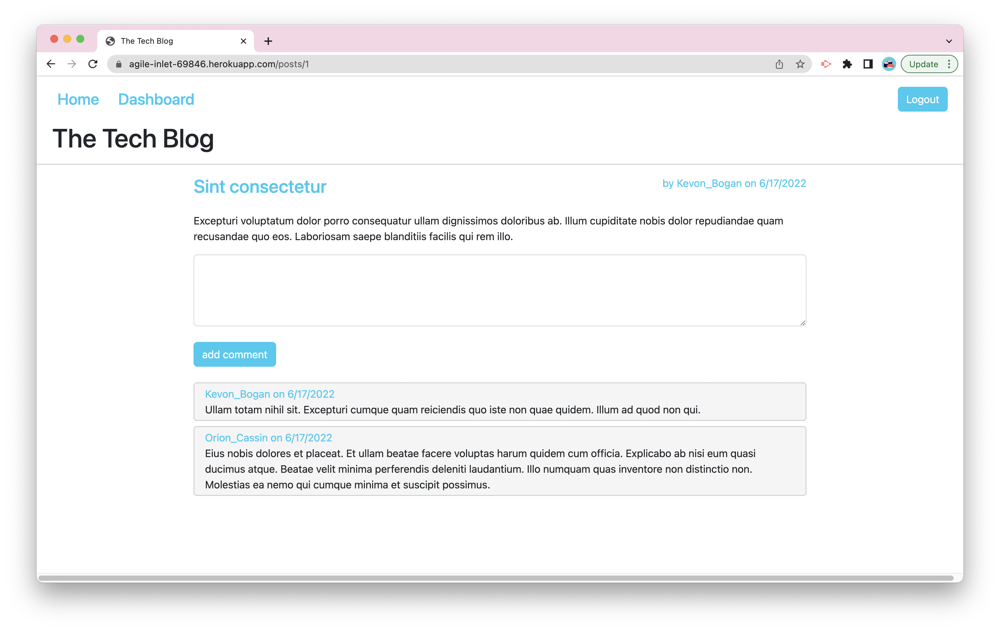

# The Tech Blog


## Description

This project is a full-stack application that allows users to read, write, edit blog posts, and leave comments. The application follows the MVC paradigm and is written in Javascript. It uses express to create a RESTful API for the controllers. MySQL along with sequelize ORM are used for the models. And Handlebars as a templating engine for the views. Express sessions and connect session sequelize packages are used to add authentication. Dotenv package used to store environment variables. Bcrypt package is used to hash passwords. Casual package is used to seed fake data.

  <br>

## Table of Contents

- [Installation](#installation)
- [Usage](#usage)
- [Deployed Link](#deployed-link)
- [License](#license)
- [Questions](#questions)  
  <br>

## Installation

Use the following command to download dependencies for the project:

```
npm install
```

Use the following command to seed the database:

```
npm run seed
```

  <br>

## Usage


</br>
The application allows you to view post and comments. Once signed in, the application allows you to create, edit and delete posts, as well as leave and delete comments. The session will timeout after 30 minutes of inactivity.
<br>

## Deployed Link

https://agile-inlet-69846.herokuapp.com/
</br>

## License

This project is licensed under the [MIT License](https://choosealicense.com/licenses/mit/).  
 </br>

## Questions

[GitHub](https://github.com/dneflas)
