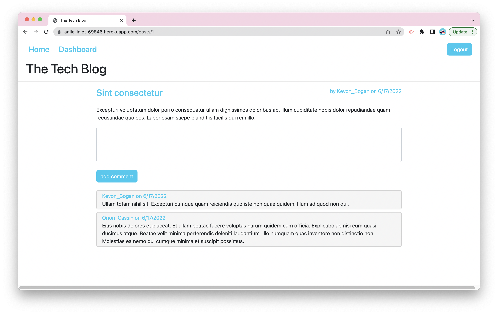

# The Tech Blog

## Description

The Tech Blog is a full-stack web application that allows users to create, edit, and interact with blog posts and comments. The application follows the MVC architecture and is built with JavaScript, Express, MySQL, Sequelize ORM, and Handlebars.

In addition to core full-stack functionality, this project has been enhanced with **Site Reliability Engineering (SRE) practices**, including containerization, multi-service orchestration, CI/CD automation, and health monitoring.

---

## 🚀 SRE & DevOps Features

This project has been extended to simulate a production-ready environment:

- **Containerization**
  - Dockerized Node.js application for consistent environments
  - Eliminates “works on my machine” issues

- **Multi-Service Architecture**
  - Docker Compose used to run:
    - Application service
    - MySQL database service
  - Internal container networking via service names

- **Environment Configuration**
  - Environment variables managed via `.env`
  - Secure handling using GitHub Secrets in CI

- **CI/CD Pipeline**
  - Automated pipeline using GitHub Actions
  - Runs on every push and pull request
  - Steps include:
    - Install dependencies
    - Build Docker image
    - Spin up services
    - Run health checks

- **Health Monitoring**
  - `/health` endpoint implemented
  - Used by CI to verify application readiness

- **Resilience Concepts**
  - Handles service startup dependencies (app vs database)
  - Demonstrates real-world debugging of container networking and timing issues

---

## 🧱 Tech Stack

- **Backend:** Node.js, Express
- **Frontend:** Handlebars, HTML, CSS
- **Database:** MySQL
- **ORM:** Sequelize
- **Authentication:** Express Sessions
- **Other Tools:**
  - bcrypt (password hashing)
  - dotenv (environment variables)
  - Docker & Docker Compose
  - GitHub Actions (CI/CD)

---

## 📦 Installation

Clone the repository and install dependencies:
`npm install`

---

## 🐳 Run with Docker (Recommended)

Build and start services:
`docker compose up --build`

Application will be available at:
http://localhost:3002

---

## 🌱 Seed the Database

`npm run seed`

---

## 🔍 Health Check

Verify the application is running:
http://localhost:3002/health

Expected response:
`OK`

---

## 🖥️ Usage

- View blog posts and comments
- Sign up / log in to create content
- Create, edit, and delete posts
- Add and remove comments
- Sessions expire after 30 minutes of inactivity

---

## 🔄 CI/CD Pipeline

The project includes an automated CI pipeline that:

- Builds the application
- Starts services using Docker Compose
- Verifies application health via endpoint testing

This ensures:

- Reliable builds
- Early detection of failures
- Consistent deployments

---

## 🌐 Deployed Link

https://agile-inlet-69846.herokuapp.com/

---

## 🧠 Key Learnings

- Containerizing full-stack applications with Docker
- Managing multi-service systems using Docker Compose
- Debugging container networking and environment issues
- Implementing CI/CD pipelines for automated testing and builds
- Applying SRE principles like health checks and service readiness

---

## License

This project is licensed under the [MIT License](https://choosealicense.com/licenses/mit/).

---

## Questions

GitHub: https://github.com/dneflas
